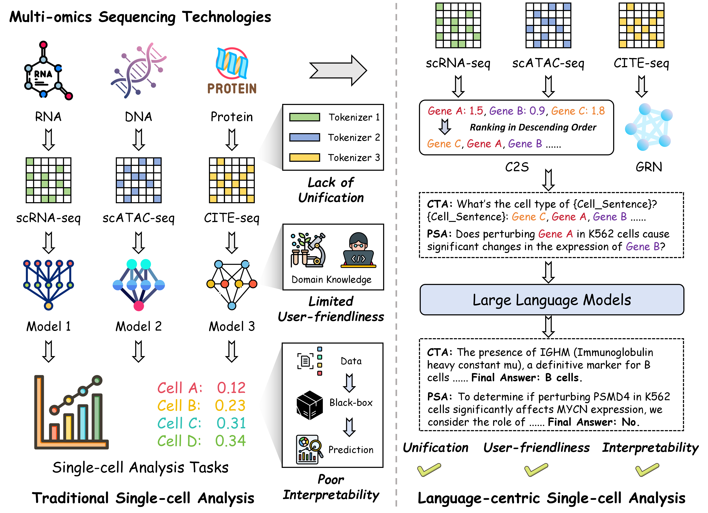
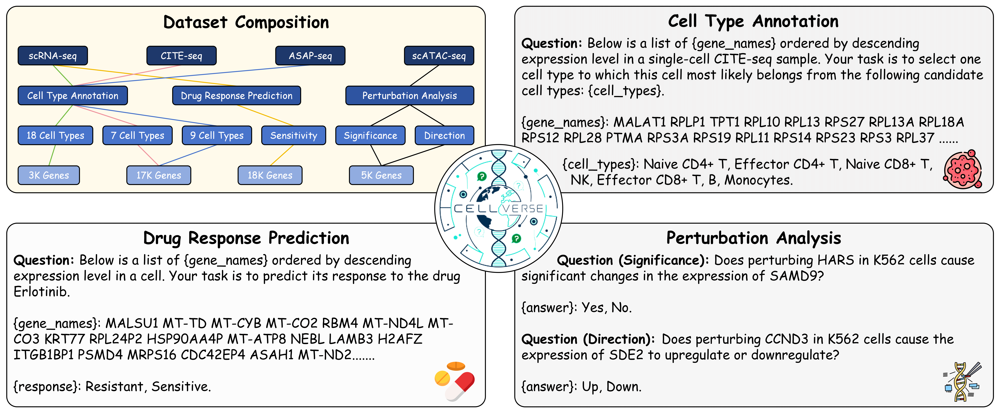

# CellVerse: Do Large Language Models Really Understand Cell Biology?

 
 
 

 


Official repository for the paper "CellVerse: Do Large Language Models Really Understand Cell Biology?"


🌟 For more details, please refer to the project page: [https://cellverse-cuhk.github.io](https://cellverse-cuhk.github.io/).

[[🌐 Webpage](https://cellverse-cuhk.github.io/)] [[📖 Paper](https://arxiv.org/pdf/2505.07865)] [[🤗 Huggingface Dataset](https://huggingface.co/datasets/Karl28/CellVerse)] [[🏆 Leaderboard](https://cellverse-cuhk.github.io/#leaderboard)]


## 💥 News
- **[2025.05.08]** 🚀 We release the ***test*** set of CellVerse at [[🤗 Huggingface Dataset]](https://huggingface.co/datasets/Karl28/CellVerse), and the [inference code](https://github.com/zfkarl/CellVerse/tree/master/evaluation)!

## 👀 About CellVerse

The capabilities of **Large Language Models (LLMs)** in **Cell Biology Understanding** remain insufficiently evaluated and understood. We investigate the differences between the traditional single-cell analysis paradigm and the language-centric paradigm, and find that the latter offers advantages in terms of **unification**, **user-friendliness**, and **interpretability**.

<p align="center">
     <br>
</p>

To this end, we introduce **CellVerse**, a language-centric single-cell analysis benchmark designed for an equitable and in-depth evaluation of LLMs. The whole dataset encompasses four types of single-cell multi-omics data (scRNA-seq, CITE-seq, ASAP-seq, and ASAP-seq data) and spans three sub-tasks: cell type annotation, drug response prediction, and perturbation analysis. This approach allows CellVerse to uncover both ***capabilities and limitations of current LLMs in understanding cell biology.***

<p align="center">
     <br>
</p>

In addition, we systematically evaluate the performance of 14 open-source and closed-source advanced LLMs on CellVerse.


## 🚀 Inference

We provide two formats for inference on CellVerse using APIs and [vLLM](https://github.com/vllm-project/vllm).

Inference using APIs:
```bash
python ./evaluation/infer_api.py \
    --model_name "$Model" \
    --openai_api_key "$API" \
    --base_url "$URL" \
    --output_path "./results/response.json" \
    --dataset_path "./data/cta_scrna_full.json" 
```


Inference using [vLLM](https://github.com/vllm-project/vllm):
```bash
python ./evaluation/infer_vllm.py \
    --model_name "$Model" \
    --output_path "./results/response.json" \
    --dataset_path "./data/cta_scrna_full.json" 
```

## 💪 Evaluation

After getting model responses (saved in `output_path`), you can extract the answer and calculate the metrics.

Here we provide an example of the extracted answer at `./results/ms_cta_response_deepseek_r1.json`.


## 🏆 Leaderboard

| **#** | **Model**            | **Type** | **Source**  | **Date**   |  **Avg**  | **CTA (scRNA-seq)**  | **CTA (CITE-seq)** | **CTA (ASAP-seq)** | **DRP** | **PSA** | **PDA** |
| ----- | -------------------- | -------- | ----------- | ---------- | -------- | ------- | ------- | ------- | ------- | ------- | ------- | 
| 1     | **DeepSeek-R1 🥇**      | Open     | [Link](https://huggingface.co/deepseek-ai/DeepSeek-R1)  | 2025-03 | 53.05 |42.38 | 58.29 | 28.00 | 50.00 | 76.67  | 62.96 | 
| 2     | **GPT-4.1-mini 🥈**     | Close    | [Link](https://platform.openai.com/docs/models/gpt-4.1-mini) | 2025-04 | 52.24 |40.51 |	59.14 |	29.33 |	55.00 	|68.33 |	61.11 | 
| 3     | **GPT-4o 🥉**           | Close    | [Link](https://platform.openai.com/docs/models/gpt-4o) | 2024-11 | 49.45 |35.70 |	58.29 |	28.00 |	47.50 |	71.67 |	55.56 | 
| 4     | **GPT-4.1**          | Close    | [Link](https://platform.openai.com/docs/models/gpt-4.1) | 2025-04 | 49.41 |37.83 |	61.43 |	28.22 	|49.38 |	73.33 |	46.30  | 
| 5     | **LLaMA-3.3-70B**    | Open     | [Link](https://huggingface.co/meta-llama/Llama-3.3-70B-Instruct) | 2024-12 |45.86 | 32.75 |52.57 |	22.00 |	43.75 |	66.67 |	57.41 | 
| 6     | **DeepSeek-V3**      | Open     | [Link](https://huggingface.co/deepseek-ai/DeepSeek-V3) | 2025-03 |45.53 | 37.57 | 57.14 | 27.11 | 50.63 | 76.67  | 24.07 | 
| 7     | **Qwen-2.5-72B**     | Open     | [Link](https://huggingface.co/Qwen/Qwen2.5-72B) | 2024-09 | 43.66 |24.73 |	50.29 |	28.44 |	50.00 |	73.33 |	35.19  | 
| 8     | **Qwen-2.5-32B**     | Open     | [Link](https://huggingface.co/Qwen/Qwen2.5-32B) | 2024-09 | 37.97 |22.46 |	48.86 |	23.11 |	45.63 |	76.67 |	11.11  | 
| 9     | **Qwen-2.5-7B**      | Open     | [Link](https://huggingface.co/Qwen/Qwen2.5-7B) | 2024-09 | 35.16 |13.77 |	30.86 |	10.67 |	49.38 |	76.67 |	29.63   | 
| 10    | **GPT-4o-mini**      | Close    | [Link](https://platform.openai.com/docs/models/gpt-4o-mini) | 2024-07 | 34.38 |23.93 |	48.57 |	16.89 |	43.75 |	41.67 |	31.48  | 
| 11    | **GPT-4**            | Close    | [Link](https://platform.openai.com/docs/models/gpt-4) | 2023-06 | 18.57 |35.16 |	53.43 |	21.56 	|1.25 |	0.00 |	0.00   | 
| 12    | **C2S-Pythia-1B**    | Open     | [Link](https://huggingface.co/vandijklab/C2S-Scale-Pythia-1b-pt) | 2025-04 | 0.00| 0.00 |	0.00 |	0.00 |	0.00 |	0.00 |	0.00  | 
| 12    | **C2S-Pythia-410M**  | Open     | [Link](https://huggingface.co/vandijklab/C2S-Pythia-410m-diverse-single-and-multi-cell-tasks) | 2024-09 | 0.00| 0.00 |	0.00 |	0.00 |	0.00 |	0.00 |	0.00  | 
| 12    | **C2S-Pythia-160M**  | Open     | [Link](https://huggingface.co/vandijklab/pythia-160m-c2s) | 2024-02 | 0.00| 0.00 |	0.00 |	0.00 |	0.00 |	0.00 |	0.00  | 


## :white_check_mark: Citation

If you find **CellVerse** useful for your research and applications, please kindly cite using this BibTeX:

```latex
@misc{zhang2025cellverselargelanguagemodels,
      title={CellVerse: Do Large Language Models Really Understand Cell Biology?}, 
      author={Fan Zhang and Tianyu Liu and Zhihong Zhu and Hao Wu and Haixin Wang and Donghao Zhou and Yefeng Zheng and Kun Wang and Xian Wu and Pheng-Ann Heng},
      year={2025},
      eprint={2505.07865},
      archivePrefix={arXiv},
      primaryClass={q-bio.QM},
      url={https://arxiv.org/abs/2505.07865}, 
}
```


🔥 Please contact `zfkarl1998@gmail.com` if you would like to contribute to the leaderboard or have any problems.
